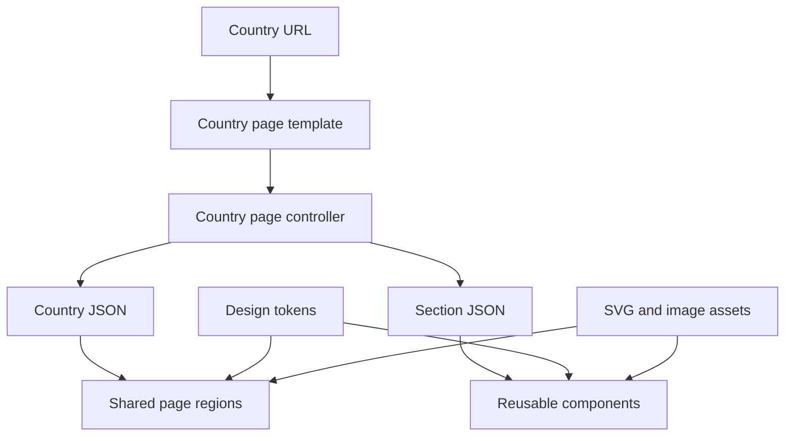

# Architecture

## Overview

Pareto Travel is a static, component-based editorial website. A shared country-page template loads country-specific JSON and mounts reusable visual components. Shared styles provide the design foundation; component styles and scripts own only component behavior.

## Architectural goals

- One reusable page template for all countries.
- Data-driven content without duplicating page markup.
- Portable components with explicit inputs.
- No framework or build dependency by default.
- Exact visual fidelity to Figma.
- Progressive enhancement and accessible semantics.
- A structure that remains easy to understand and debug.

## Layers

### Foundation

The foundation includes:

- `reset.css` for browser normalization;
- `tokens.css` for primitive and semantic CSS variables;
- `typography.css` for font faces, type tokens, and reusable type styles;
- `global.css` for document defaults, layout utilities, accessibility utilities, and shared behavior.

These files must not contain component-specific geometry.

### Page template

The country-page template owns:

- document metadata and shared landmarks;
- page-level section order;
- mount points for reusable components;
- page-level responsive layout;
- loading and unavailable-section states.

It should not hard-code country-specific editorial content.

### Page controller

The country-page controller owns:

- resolving the country slug;
- loading the relevant JSON;
- checking HTTP failures and invalid data;
- distributing normalized data to page regions and components;
- deciding whether optional sections should render;
- reporting actionable development errors.

The controller should coordinate components, not absorb their rendering details.

### Components

Each reusable component owns:

- normalization of its focused input;
- semantic rendering inside its root;
- component-scoped presentation;
- its events, animation, and lifecycle;
- accessible states and reduced-motion behavior.

Components must support multiple instances where reasonable.

### Data

JSON owns country-specific content and configuration. It may be organized as one country document or focused section documents. Use the repository’s established approach consistently.

See `data-model.md` for ownership rules and example shapes.

### Assets

Use external assets for detailed SVGs and imagery. HTML or JSON should reference those files rather than embedding very large SVG payloads.

## Runtime flow

1. The browser opens a country URL or template with a country slug.
2. The controller resolves the slug without trusting arbitrary filesystem input.
3. It fetches country metadata and required section data.
4. It validates or normalizes data at module boundaries.
5. It renders shared page regions.
6. It mounts each available reusable component.
7. Components bind their own interactions and motion preferences.
8. Missing optional content is omitted or shown with an intentional fallback.

## Dependency direction

- Pages may depend on components.
- Components may depend on shared tokens, typography, and small utilities.
- Components must not depend on a specific country page.
- Data must not encode HTML fragments or CSS rules.
- Foundation styles must not depend on components.

Avoid circular imports and hidden global state.

## URL and slug handling

Use the routing pattern already present in the repository. Common static-site options include:

- `/country.html?country=mexico`
- `/countries/mexico/` with server routing or generated entry files

Do not switch patterns casually. Treat public URLs as a compatibility boundary.

Normalize slugs to lowercase kebab-case and validate them against known country data before building fetch paths.

## Error handling

Differentiate between:

- a missing country, which should produce a clear page-level unavailable state;
- a missing optional section, which should not break the rest of the page;
- malformed required data, which should produce an actionable development error;
- a missing asset, which should preserve layout and provide appropriate alternative text or fallback treatment.

Never swallow fetch or render errors silently.

## Performance

- Reserve image dimensions to reduce layout shift.
- Lazy-load below-the-fold imagery when appropriate.
- Avoid mounting components that have no data.
- Keep SVGs external when inline payloads would dominate HTML.
- Avoid repeated fetches for the same country document.
- Do not add optimization complexity without measuring a real problem.

## Security boundaries

- Treat JSON and URL parameters as untrusted input.
- Use `textContent` or explicit DOM construction for external strings.
- Do not insert untrusted HTML with `innerHTML`.
- Validate asset paths and slugs rather than concatenating arbitrary user input.
- Do not commit secrets or environment-specific credentials.

## When to change this document

Update this file when page composition, data-loading flow, dependency direction, routing, or top-level directories change.
